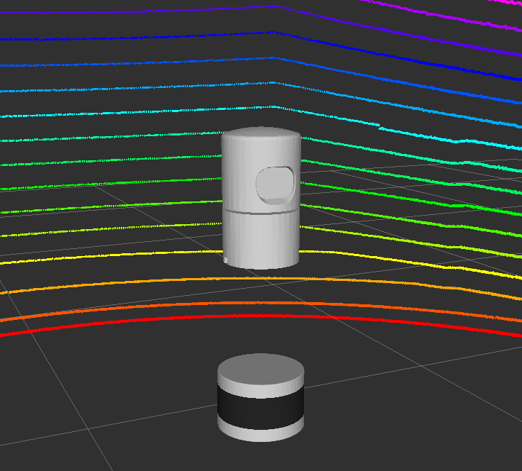

# Velodyne Simulator
URDF description and Gazebo plugins to simulate Velodyne laser scanners



# Features
* URDF with colored meshes
* Gazebo plugin based on [gazeboo_plugins/gazebo_ros_block_laser](https://github.com/ros-simulation/gazebo_ros_pkgs/blob/kinetic-devel/gazebo_plugins/src/gazebo_ros_block_laser.cpp)
* Publishes PointCloud2 with same structure (x, y, z, intensity, ring)
* Simulated Gaussian noise
* Supported models:
    * [VLP-16](velodyne_description/urdf/VLP-16.urdf.xacro)
    * [HDL-32E](velodyne_description/urdf/HDL-32E.urdf.xacro)

# Parameters
* ```*origin``` URDF transform from parent link.
* ```parent``` URDF parent link name. Default ```base_link```
* ```name``` URDF model name. Also used as tf frame_id for PointCloud2 output. Default ```velodyne```
* ```topic``` PointCloud2 output topic name. Default ```/velodyne_points```
* ```hz``` Update rate in hz. Default ```10```
* ```lasers``` Number of vertical spinning lasers. Default ```VLP-16: 16, HDL-32E: 33```
* ```samples``` Nuber of horizontal rotating samples. Default ```VLP-16: 1875, HDL-32E: 2187```
* ```min_range``` Minimum range value in meters. Default ```0.9```
* ```max_range``` Maximum range value in meters. Default ```130.0```
* ```noise``` Gausian noise value in meters. Default ```0.008```
* ```min_angle``` Minimum horizontal angle in radians. Default ```-3.14```
* ```max_angle``` Maximum horizontal angle in radians. Default ```3.14```

# Known Issues
* At full sample resolution, Gazebo can take up to 30 seconds to load the VLP-16 pluggin, 60 seconds for the HDL-32E
* Gazebo cannot maintain 10Hz with large pointclouds
    * Solution: User can reduce number of points (samples) or frequency (hz) in the urdf parameters, see [example.urdf.xacro](velodyne_description/urdf/example.urdf.xacro)
* Gazebo crashes when updating HDL-32E sensors with default number of points. "Took over 1.0 seconds to update a sensor."
    * Solution: User can reduce number of points in urdf (same as above)
* Gazebo versions in indigo and jade have different z orientations
    * Solution: Maintain separate branches for urdf changes (gazebo2 and master)

# Example Gazebo Robot
```roslaunch velodyne_description example.launch```
